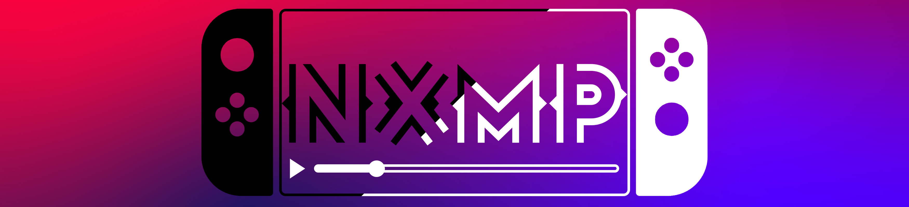

RipJKAnime 2 NX
======

RipJKAnime 2 NX es una aplicación para ver anime online desde JKAnime.net basado en NXMP, reproductor multimedia creado por proconsule.
NXMP support most popular video format , it support HTTP,FTP,SFTP,Samba,NFS streaming and it also support Enigma2 decoders.
Starting from 0.7.0 Version it features HW Decoding for H264,HEVC,VP8,VP9,MPEG2 up to 4K HDR@30fps

Usage
-----
Buttons Mapping
- A select (play/pause during playback)
- B back (stop during playback)
- Y Main Menu
- X show OSD (during playback)
- R L ZR ZL (seek +/-  during playback)
- \- Exit NXMP
- R Stick Button Toggle Masterlock (during playback, only A button will work)
- Dpad Right (during playback show/hide right menu)
- Dpad Down (during playback show/hide player UI)
- R Stick Up/Down Fast Scroll on file list (Volume Control During Playback)
- \+ Show file selection during playback

FAQ
-----
**Question:** My 4K file dont work? Why?

**Answer** ~~Keep in mind that currently Homebrew apps can't access the HW Decoder, so all is done with CPU, 4K file is too heavy to be decoded~~ **From version 0.7.0 NXMP have HW Decoding for format H264,HEVC,VP9,MPEG2 it can decode up to 4K HDR@30fps**

**Q:** What is Enigma2?

**A:** Enigma2 is an application used in Linux-based Digital Video Broadcasting (DVB-S, DVB-C, DVB-T) receivers or TV set-top boxes and Internet Protocol television receivers.

**Q:** What is ShaderMania?

**A:** ShaderMania is an useless but fun feature of NXMP, it uses the ability of MPV to load custom shader into the video output chain. I adopt some shaders from https://www.shadertoy.com/ to make shaders effects to the video. Some like grayscale may be usefull for someone others (like the sea shaders) is only for fun. Users can also make their custom shaders and place in mpv/shaders directory.

Thanks to
-----
- Cpasjuste for pPlay https://github.com/Cpasjuste/pplay some code was taken here (mpv and Overclock part)
- DarkMatterCore for libusbhsfs https://github.com/DarkMatterCore/libusbhsfs (this gives NXMP USB support)
- Averne for HW Decoding on Tegra X1 https://github.com/averne/FFmpeg and for all the hints and help (thanks a lot!)
- Chocola @ GBATemp forum for usage guide and beta testing
- sashka69 @ GBATemp forum for beta testing
- bodyXY @ GBATemp forum for banner and icons
- Godorowski @ GBATemp forum for player UI design and icons
- nWo @ GBATemp for beta testing
- docgold @ GBATemp forum for Enigma2 samples and support on decoders
- tataniko @ GBATemp forum for suggestions and bug hunting
- All guys on GBAtemp
